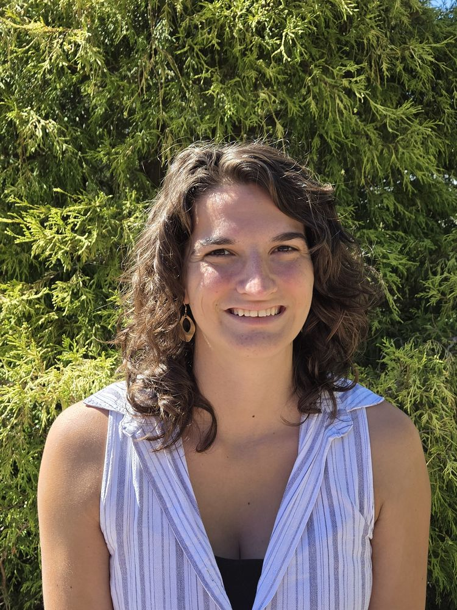

# CLAUDE.md

Project context and working rules for this repository. Read this before making changes.

## What this is

The personal academic website for **Alyson East**, quantitative ecologist (PhD
candidate, University of Maine). It is a **static site**: plain HTML and CSS, no
build step, no framework, no package manager. It is hosted on **GitHub Pages** and
must stay fully self-contained (no dependency on Wix or any external host for
content or images).

The only external resources loaded at runtime are:
- Google Fonts (Spectral + IBM Plex Sans), via `<link>` in each page's `<head>`.
- Altmetric and Dimensions metric badges on the two project pages (loaded by DOI).

Do not introduce a build tool, bundler, CSS framework, JS framework, or npm
dependencies. Keep everything editable by hand.

## File map

| File | Purpose |
|------|---------|
| `index.html` | Home: about, Selected highlights, Research overview, full News feed, Contact |
| `publications.html` | Full publication + conference-paper list |
| `teaching.html` | Teaching philosophy, courses (grouped by institution), mentorship |
| `research-forest-scaling.html` | In-depth project page (tree crowns → forest patterns) + live metrics |
| `research-beetles.html` | In-depth project page (beetles, big data, AI) + live metrics |
| `style.css` | All styling for every page. Edit tokens in `:root` to restyle globally |
| `assets/` | Images and files (photos, CV PDF). Also `assets/beetles/`, `assets/forest/` |
| `.nojekyll` | Tells GitHub Pages to serve files as-is |

Nav on every page: **About · Research · Publications · Teaching · News · Contact**.
About / Research / News / Contact are sections of `index.html`; Publications and
Teaching are their own pages; the two project pages are linked from the Research
section on the home page. If you change the nav, change it in every HTML file.

## Design system (do not drift from this)

Defined once in `style.css` under `:root`:
- Colors: `--paper #f5f7f1`, `--ink #1b2820`, `--accent #235f55` (spruce-teal),
  plus soft/faint variants and `--line` for dividers.
- Type: `--serif` = Spectral (name, headings, narrative); `--sans` = IBM Plex Sans
  (nav, dense lists, dates, labels).
- Prose line length is capped (`--measure`). Keep it.

Reuse existing components and class names rather than inventing new ones:
`.hero-inner` / `.hero-grid` / `.hero-photo`, `.subhero` / `.subhero-img`,
`.metrics` / `.metric` / `.metric-num` / `.metric-label`, `.gallery`,
`.highlights`, `.rblock`, `.pub-list` / `.pub-inline`, `.course` / `.role-line`,
`.mentor`, `.facts`, `.news-year` / `.news-month` / `.news-list`.

Keep the quality floor: responsive to mobile, visible keyboard focus, meaningful
`alt` text on images, `prefers-reduced-motion` respected. Don't add scroll
animations or hover effects beyond what's already there.

## Content & voice conventions

- **Preserve Alyson's wording.** Don't rewrite her copy. Make targeted edits.
- **No em dashes** anywhere in prose. Use commas, parentheses, or a period.
- **No "meta" separators in prose** (e.g. `A · B · C`, or a spaced en/em dash used
  as a label). The middle dot is fine only inside existing metadata lines like
  `.role-line` and `.news-month` groupings that already use it.
- **News items:** each `<li>` may bold **one** key phrase with `<strong>` to draw
  it out. One phrase per item, no more.
- **Role accuracy matters.** Don't inflate titles or responsibilities. Preserve
  wording like "contributed to," "helped lead," "validated the package."
- Don't invent facts, links, dates, DOIs, or metrics. If something's unknown,
  leave it or ask.

## Images

The site is built so a **missing image never breaks the layout** — banner and
gallery images hide themselves via `onerror="this.style.display='none'"`. Keep that
pattern on any image you add.

Expected paths and shapes (crop with `object-fit`, already handled by CSS):
- `assets/portrait.jpg` — home portrait, portrait orientation ~3:4.
- `assets/beetles-hero.jpg`, `assets/forest-hero.jpg` — project banners, wide ~21:9.
- `assets/beetles/01.jpg`, `02.jpg`, … — beetle gallery, square ~1:1.
- `assets/forest/01.jpg`, `02.jpg`, … — forest gallery, square ~1:1.
- `assets/cv.pdf` — optional CV (if added, link it in the nav on every page).

Prefer these conventional filenames: copy/rename source photos into them so the
existing slots light up, rather than scattering references to arbitrary names.

### Enabling the optional slots

**Home two-column portrait** (`index.html`): the hero is single-column by default.
To show a portrait beside the bio, change `<div class="wrap hero-inner">` to
`<div class="wrap hero-grid">` and, before that div closes, add:
```html
<div></div>
```

**Project galleries** (`research-beetles.html`, `research-forest-scaling.html`):
each page has a commented-out `<div class="gallery">…</div>` block and a
`.gallery-empty` note. To turn a gallery on: delete the `.gallery-empty` paragraph,
remove the `<!--` / `-->` around the gallery, and set one `` per image with the
right filenames and meaningful `alt` text.

**Project banners:** already wired — just add `assets/beetles-hero.jpg` /
`assets/forest-hero.jpg` and they appear.

### Sizing (optional)

If ImageMagick or Python/Pillow is available and a source image is very large
(> ~2000px on the long edge), you may downscale for web (portrait ~1000px wide,
banner ~1600px wide, gallery ~1000px square, JPEG quality ~80). This is a
nice-to-have, not required — `object-fit` handles cropping either way. Never
upscale, and keep an original if you overwrite.

## How to add content later

- **News:** in `index.html` `#news`, copy an `<li>` into the right month, newest at
  top; optionally bold one phrase.
- **Publication:** in `publications.html`, copy an entry in the right year's
  `<ul class="pub-list">`; `<span class="me">` bolds her name.
- **Course / mentee:** in `teaching.html`, copy a `.course` or `.mentor` block.

## Metrics badges

The project pages carry Altmetric (attention donut) and Dimensions (citation)
badges that load live by DOI. **Don't change the `data-doi` values or the badge
`<script>` tags unless explicitly asked.** They render only on the live/served site,
not in a local file preview.

## Working style

- Make small, targeted edits. Don't regenerate whole files to change a few lines.
- Preview locally before finishing: `python3 -m http.server 8000` and open the
  pages; check that internal links and images resolve.
- When a choice is ambiguous (which photo goes where, whether to add a slot that
  doesn't exist yet), propose a plan and ask before doing it.
- Report what changed: files edited, images placed, and anything left unplaced.
